> 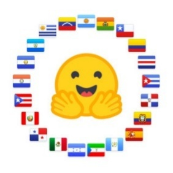
>
> Análisis de prompts de la Arena
>
> Hackathon 2025
>
> Constanza Jeldres García
>
> Trabajo final de prácticas de lingüista computacional en Somos NLP

#  Introducción

En el marco del Hackathon SomosNLP 2025, se planteó un reto centrado en la creación de un *dataset de preferencias* mediante prompts que evalúan la adecuación cultural en distintos países de Latinoamérica y la Península Ibérica. El objetivo principal fue identificar y recoger las respuestas generadas por distintos modelos de lenguaje (LLMs) frente a indicaciones culturalmente sensibles, comparándolas en una plataforma colaborativa (“LLM Arena”).

Este desafío surge del reconocimiento de que los modelos de lenguaje modernos suelen estar sesgados hacia perspectivas dominantes -a menudo angloparlantes-, y pueden no responder con pertinencia o conciencia cultural en contextos hispanohablantes. Por lo tanto, la iniciativa pretende impulsar una alineación más equitativa y contextualizada de los LLMs, mediante la recolección estructurada de prompts y respuestas que reflejen las particularidades culturales de cada país hispanohablante.

Este informe se estructura en varias secciones:

1.  **Metodología**, donde se detalla el proceso de diseño de prompts y generación del dataset, además de la metodología y herramientas utilizadas para el análisis.

2.  **Análisis**, en el que se examinan los resultados, patrones culturales, respuestas destacadas y evaluaciones cruzadas entre países.

3.  **Limitaciones y dificultades**, que enumera los desafíos y dificultades encontrados (por ejemplo, diversidad cultural, ambigüedad de instrucciones, limitaciones del modelo, etc.).

4.  **Conclusiones**, donde se extraen aprendizajes clave y se propone orientación para futuras iteraciones o mejoras.

Con esta estructura, se busca ofrecer una visión clara y profunda sobre el potencial y las barreras existentes al tratar de alinear LLMs con contextos culturales diversos dentro del mundo hispanohablante.

# Metodología

## 2.1 Diseño de los Prompts

El diseño de los prompts tuvo como objetivo principal generar instrucciones que permitieran evaluar la adecuación cultural, lingüística y pragmática de las respuestas producidas por distintos modelos de lenguaje de gran tamaño (LLMs) en contextos específicos de países hispanohablantes. Para ello, se definieron criterios que garantizaran la representatividad regional, la diversidad temática y la posibilidad de detectar diferencias sutiles en la producción lingüística de los modelos.

Los prompts se clasificaron en tres grandes categorías, adaptadas a las particularidades del español según país:

1.  **Evaluación y análisis**: prompts que solicitan identificar o explicar el significado, el uso o el registro de una expresión o construcción lingüística propia del país (ej. “¿Qué significa *irse al chancho* en Chile?”).

2.  **Generación lingüística**: instrucciones que requieren al modelo generar texto en un registro o variedad regional concreta, ya sea informal, coloquial o dialectal (ej. “Escribe un diálogo entre adolescentes en el español de Lima, Perú”).

3.  **Adecuación y corrección cultural**: tareas que ponen a prueba la capacidad del modelo para detectar errores o sugerir ajustes en función del contexto cultural del país en cuestión (ej. “¿Es apropiada esta expresión en una carta formal en España?”).

Para cada país, se elaboraron entre 40 y 80 prompts, procurando una cobertura balanceada entre categorías y temas. Los temas abordaron desde modismos y expresiones idiomáticas hasta aspectos socioculturales como formas de cortesía, referencias locales, tabúes lingüísticos y prácticas comunicativas típicas.

El proceso de creación fue manual, realizado por una lingüista computacional con experiencia en variación dialectal del español. Se consultaron fuentes académicas, corpus lingüísticos y observaciones empíricas del uso real de la lengua en redes sociales, medios y conversaciones informales.

Cada prompt fue diseñado para permitir la comparación entre al menos dos respuestas del modelo, con el fin de ser evaluadas posteriormente mediante preferencia (DPO - Direct Preference Optimization). Estas respuestas se cargaron en la plataforma LLM Arena, donde usuarios de distintos países pudieron votar por la opción más adecuada.

En paralelo, se etiquetó internamente cada prompt con metadatos como país, categoría, grado de formalidad, dificultad percibida y si incluía o no expresiones idiomáticas.

### 2.1.1 Características generales exigidas para el diseño de los prompts

Para asegurar la utilidad del dataset en el proceso de alineación por preferencias y la evaluación de modelos multivariantes, los prompts debían cumplir con una serie de criterios definidos por la organización del hackathon. Estas características fueron clave para garantizar la calidad, comparabilidad y pertinencia cultural de las respuestas generadas. Las principales fueron:

- **Claridad y especificidad**: los prompts debían estar formulados de forma clara, evitando ambigüedades o instrucciones demasiado generales. Se privilegiaron tareas que dieran lugar a respuestas contrastables.

- **Formato instruccional**: cada prompt debía estar formulado como una instrucción explícita para el modelo, por ejemplo: *"Escribe...", "Corrige...", "Explica...", "Evalúa si..."*.

- **Sensibilidad cultural**: se priorizó que cada prompt reflejara aspectos culturales, lingüísticos o pragmáticos propios del país hispanohablante al que iba dirigido. Esto incluía expresiones idiomáticas locales, registros específicos, formas de tratamiento o referencias socioculturales.

- **Diversidad temática**: se fomentó la inclusión de una amplia gama de contextos (informales, formales, educativos, cotidianos, etc.) y dominios discursivos (literatura, redes sociales, trabajo, juventud, etc.).

- **Neutralidad política, religiosa y ética**: los prompts debían evitar reproducir sesgos sensibles o inducir a respuestas que pudieran resultar ofensivas o discriminatorias.

- **Compatibilidad con evaluación por preferencias**: los prompts debían permitir la comparación de dos o más respuestas generadas por modelos distintos, de modo que un evaluador pudiera elegir cuál de ellas se ajustaba mejor al contexto propuesto.

- **Longitud moderada**: se recomendó que los prompts no excedieran las 2 o 3 líneas, salvo cuando el contexto lo requiriera, para facilitar tanto la evaluación humana como el procesamiento automático.

Estas directrices se aplicaron de forma transversal en el diseño de los países contemplados, permitiendo una base común que a la vez respetara las particularidades de cada variedad del español.

## 2.1.2 Preparación para evaluación en LLM Arena:

Finalmente, los prompts fueron cargados en la plataforma LLM Arena junto con dos respuestas generadas por modelos distintos para cada uno. El objetivo fue que personas evaluadoras eligieran cuál de las dos respuestas se ajustaba mejor a la consigna, permitiendo así recopilar datos de preferencia humana para procesos de fine-tuning como Direct Preference Optimization (DPO).

Este enfoque facilita la evaluación cultural de los modelos y contribuye a construir datasets multivariantes que integren la riqueza del español en sus múltiples variedades nacionales.

## 2.2 Metodología del análisis

### 2.2.1 Observación general de los datos

Para realizar el análisis general del dataset, se utilizó una metodología cuantitativa, apoyada en herramientas de visualización, como tablas y gráficos, propios del análisis estadístico básico y del procesamiento textual. Todo esto con el objetivo de describir el conjunto de datos, considerando: distribución de prompts por país, longitud de los textos, complejidad y similitud semántica entre respuestas y clasificación temática de los prompts y sus respuestas.

Todo el análisis se realizó en Google Colab, con exportación automatizada de los resultados a Google Drive.

**a) Herramientas y bibliotecas utilizadas**

pandas para procesamiento de datos estructurados.

matplotlib y seaborn para la visualización gráfica.

scikit-learn para el cálculo de similitud textual mediante TF-IDF y similitud coseno.

transformers de Hugging Face para clasificación temática automatizada (zero-shot classification).

Google Drive (/MyDrive/graficos_dpo) como entorno de almacenamiento.

**b) Procesamiento y análisis realizados**

1.  **Distribución de prompts por país:** se utilizó sns.countplot() para visualizar la cantidad de prompts por país. Esta visualización permitió detectar desequilibrios en la representación geográfica del dataset, lo que tiene implicaciones directas en el fine-tuning de modelos multivariantes.

2.  **Longitud media de textos por país:** se calcularon las longitudes medias de los textos (prompt, chosen, rejected) por país y se representaron mediante un gráfico de barras agrupadas. Esto me permitió observar patrones de complejidad y detalle según región.

3.  **Similitud semántica entre respuestas:** se aplicó TfidfVectorizer() sobre cada par (chosen, rejected) y se calculó la similitud coseno con cosine_similarity(). Los resultados se visualizaron con un boxplot por país. Este análisis evidenció qué tan diferenciadas eran las respuestas generadas por los modelos, lo cual es crucial para evaluar la utilidad del dataset en alineación por preferencias.

4.  **Clasificación temática automatizada:** se implementó un pipeline de clasificación por cero disparos (zero-shot classification) usando el modelo facebook/bart-large-mnli de la biblioteca transformers. Este modelo permite asignar etiquetas temáticas sin entrenamiento específico, comparando cada texto contra una lista de categorías definidas: cultura, sociedad, lengua, historia, estereotipos, opinión y políticas públicas. Clasificando automáticamente tres tipos de textos: prompts (question), respuestas elegidas (chosen), respuestas rechazadas (rejected). Los resultados se almacenaron en un nuevo archivo CSV, que permitió realizar análisis posteriores.

5.  **Visualización de temas frecuentes por país:** se creó un gráfico de barras horizontal con la frecuencia total de cada tema, sumando las etiquetas de prompts, respuestas elegidas y rechazadas y se generaron mapas de calor (heatmaps) por país y por tipo de texto usando sns.heatmap() para observar qué temas predominan en cada región y cómo varían según el tipo de contenido.

**c) Resultados y propósitos**

Esta metodología permitió: 1) detectar desequilibrios y patrones en la distribución geográfica y temática del dataset, 2) establecer diferencias claras entre países en términos de complejidad de prompts y estilo de respuestas, 3) analizar la coherencia y diferenciación entre respuestas generadas por los modelos, condición clave para tareas de preferencia humana (como DPO) y 4) obtener una categorización temática sistemática que facilita el análisis lingüístico posterior y aporta trazabilidad al proceso de generación de datos.

De esta forma, el enfoque adoptado equilibra la capacidad de reproducir la técnica adoptada y la interpretación lingüística y sienta las bases para el posterior análisis centrado en la variación estilística, adecuación cultural y preferencias humanas.

### 2.2.2 Mirada desde la lingüística computacional

El análisis lingüístico realizado sobre las respuestas generadas por modelos de lenguaje se ha estructurado en torno a dos ejes principales; la caracterización gramatical y discursiva. Para ello, se han empleado técnicas de procesamiento del lenguaje natural (PLN) que permiten cuantificar y visualizar patrones a partir de atributos lingüísticos extraídos automáticamente.

**a) Herramientas y bibliotecas utilizadas**

spaCy (es_core_news_sm) para el análisis morfosintáctico del español, incluyendo tokenización, segmentación, etiquetado POS y análisis de dependencias.

Transformers (Hugging Face) para clasificación automática de estilos discursivos y temas, usando modelos como facebook/bart-large-mnli.

Pandas y NumPy para la manipulación y análisis de datos estructurados.

Matplotlib y Seaborn para visualizar los datos con paletas accesibles para personas daltónicas.

Google Drive (/MyDrive/graficos_dpo) como entorno de almacenamiento.

Google Colab para la ejecución reproducible del análisis.

**b) Procesamiento y análisis realizados**

1.  **Análisis morfosintáctico con spaCy:** se utilizó este modelo para realizar el etiquetado gramatical y de dependencias de las respuestas, realizando tokenización y segmentación de oraciones, extracción de formas verbales para identificar:

- Tiempo verbal (presente, pasado, futuro, imperfecto).

- Persona gramatical (1ª, 2ª y 3ª).

- Registro formal/informal a partir del uso de la 2ª persona (tú/usted).

Este procesamiento permitió construir nuevas bases de datos clasificadas por país y tipo de respuestas (elegidas vs rechazadas), facilitando el análisis cualitativo comparado.

1.  **Categorización del estilo discursivo:** mediante la clasificación automática, cada respuesta fue etiquetada con un estilo discursivo dominante, el cual podía ser:

- Descriptivo

- Narrativo

- Informal

- Formal

- Otro

Esto permitió analizar la distribución global de estilos en respuestas elegidas y rechazadas, la frecuencia de estilos por país y la frecuencia de cambio de estilo entre las respuestas elegidas y rechazadas para un mismo prompt, revelando patrones de preferencia por ciertas estructuras discursivas.

1.  **Métricas de longitud y conectividad:** se calcularon métricas como longitud media de oraciones (en caracteres), por país y tipo de respuesta y el promedio de conectores discursivos por país, como indicativo de coherencia y cohesión textual. Estas métricas fueron visualizadas mediante gráficos de barras y diagramas de cajas, y su comparación ayudó a detectar diferencias estilísticas y de complejidad entre respuestas aceptadas y rechazadas.

2.  **Visualización e interpretación:** se generaron múltiples visualizaciones con Matplotlib y Seaborn, todas adaptadas para ser visibles para personas con daltonismo (colorblind-friedly palettes). Además, los gráficos fueron sistemáticamente guardados en una carpeta organizada en Google Drive (graficos_dpo), favoreciendo la trazabilidad y reproducibilidad del análisis.

**c) Resultados y propósitos**

Esta metodología permitió: 1) Evaluar patrones lingüísticos que influyen en la preferencia por parte del modelo o del evaluador humano, como mayor cohesión, longitud, registro o claridad. 2) Detectar sesgos estilísticos o culturales en la producción de respuestas por país. 3) Ofrecer criterios objetivos para la alineación por preferencias**,** evaluando cómo la elección de estilo, tono o estructura se correlaciona con la aceptación o el rechazo. 4) Establecer una base para tareas posteriores de fine-tuning o auditoría lingüística, mediante el análisis comparativo de estructuras lingüísticas.

#  Análisis

## 3.1 Análisis general 

El conjunto total contiene **686 prompts**, distribuidos entre **7 países hispanohablantes**:  
**Chile, España, México, Colombia, Nicaragua, Perú y Paraguay.** Esta diversidad geográfica permite explorar una amplia gama de variedades del español, incluyendo expresiones idiomáticas, usos culturales y registros comunicativos locales.

| **País**  | **Número de prompts** |
|:---------:|:---------------------:|
|  España   |          247          |
| Colombia  |          177          |
|   Chile   |          93           |
|   Perú    |          68           |
| Paraguay  |          65           |
| Nicaragua |          30           |
|  México   |           6           |

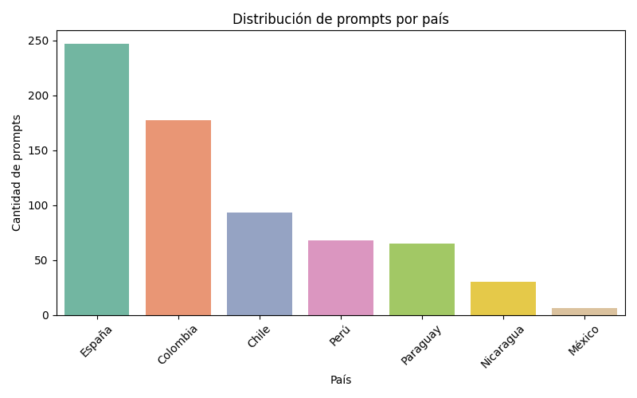

Con más de 240 prompts, España concentra más de un tercio del total del dataset. Esto sugiere que, si el modelo aprende patrones del dataset, puede estar más influenciado por formas idiomáticas, pragmáticas y estilos discursivos del español peninsular**,** lo cual es relevante para evaluar sesgos por país**.** Por otro lado, América Latina está representado de forma desigual; Colombia (180 aprox.) y Chile (90 aprox.) son los países latinoamericanos con mayor número de entradas, seguidos por Perú y Paraguay (ambos cerca de 70). México, a pesar de ser uno de los países hispanohablantes con mayor población, tiene solo unos 10 prompts, lo cual desequilibra su representación. Nicaragua aparece con menos de 40 prompts. Esto refuerza la necesidad de ampliar el corpus para países centroamericanos y del Caribe si se busca un modelo regionalmente balanceado.

## a) Implicaciones para la evaluación y fine- tuning

Cualquier evaluación comparativa de desempeño por país debe considerar este desequilibrio de datos, ya que los resultados podrían estar sesgados a favor de los países más representados. También podría impactar la detección de expresiones idiomáticas, estilos formales/informales o construcciones gramaticales preferidas.

Debido a que en el fine- tuning el modelo ajusta sus parámetros basándose en los ejemplos disponibles, los sesgos del actual dataset daría como resultado un aprendizaje sesgado hacia las variedades del español más representadas. Por lo tanto, si hay muchas más muestras de España que de México o Nicaragua, el modelo aprenderá con mayor fuerza las estructuras sintácticas más frecuentes en España (por ejemplo, uso del pretérito perfecto frente al indefinido), los modismos y expresiones idiomáticas propias del español peninsular, patrones de registro, cortesía y estilo más comunes en esa variedad. Y esto puede llevar a que prefiera respuestas más apropiadas para España, aunque el prompt provenga de otro país, genere textos que no suenen naturales para hablantes de otras variedades (p. ej., uso de "vosotros", "vale", "chaval"), y que sea menos preciso al identificar o generar expresiones coloquiales o pragmáticas específicas de los países menos representados.

Riesgo de sobreajuste local

Con un número desproporcionado de ejemplos de un país, el modelo puede sobre ajustarse a esos patrones, dificultando su capacidad de generalizar a otros dialectos. Por ejemplo: el modelo podría "normalizar" estructuras sintácticas frecuentes en España (como el uso de subjuntivo en ciertas construcciones) y penalizar o considerar erróneas otras válidas en otras regiones.

## b) Desempeño desigual y sesgo en tareas de clasificación o generación

En tareas como clasificación de formalidad, identificación de modismos o generación de respuestas, el desequilibrio puede resultar en mayor precisión para los países con más datos (España y Colombia).

Errores o incertidumbre para países con menos ejemplos (México y Nicaragua), especialmente si usan vocabulario, expresiones o construcciones que el modelo no ha visto con frecuencia.

Todo esto deriva en una evaluación injusta, pues durante la evaluación posterior del modelo, si no se controla este desbalance, se corre el riesgo de concluir que el modelo funciona “bien” cuando en realidad sólo está funcionando bien para los países dominantes en el corpus**.**

## c) Longitud y estructura de los prompts

Con respecto a la longitud de los prompts, el promedio es de aproximadamente 102 caracteres, lo que indica que la mayoría de las instrucciones son breves y directas, alineadas con el formato recomendado en el instructivo del Hackathon para evaluación de LLMs. El prompt más largo tiene 683 caracteres y pertenece a México. Se trata de una instrucción detallada para interpretar términos del argot del narcotráfico mexicano, mientras que el prompt más corto consta de sólo 7 caracteres (considerando el espacio)**,** este corresponde a España y dice simplemente “La mona”. Lo interesante de este caso es que ese prompt aparece dos veces y en ambos casos los modelos fueron capaces de interpretar esa simple instrucción como una referencia a la fábula del autor Tomás Iriarte, del siglo XVIII. Pese a lo breve de la instrucción los modelos reconocieron la referencia y generaron respuestas culturalmente contextualizadas, incluso fueron capaces de adaptar la moraleja a contextos actuales como las redes sociales, la superficialidad y la autenticidad. Este ejemplo demuestra que los modelos son capaces de activar conocimiento cultural complejo a partir de estímulos mínimos. También pone de relieve el reto de evaluar prompts muy cortos: su interpretación depende completamente del contexto inferido y no de la información explícita.

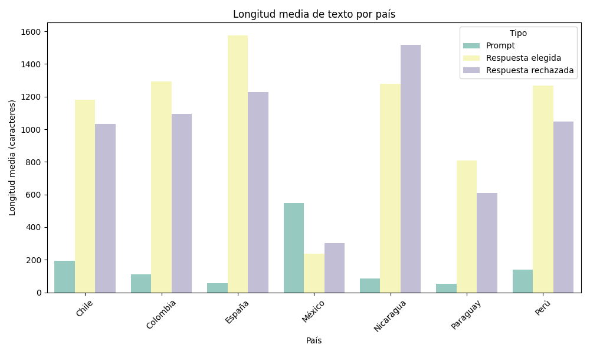

### d) Longitud de prompts por país

|  | País | Número de prompts | Longitud media | Longitud mínima | Longitud máxima |
|:---|:---|:---|:---|:---|:---|
| 1 | Chile | 93 | 193,98 | 12 | 327 |
| 2 | Colombia | 177 | 109,86 | 20 | 310 |
| 3 | España | 247 | 56,44 | 7 | 148 |
| 4 | México | 6 | 547 | 25 | 683 |
| 5 | Nicaragua | 30 | 84,73 | 42 | 197 |
| 6 | Paraguay | 65 | 52,77 | 14 | 228 |
| 7 | Perú | 68 | 140,56 | 60 | 206 |

Si nos vamos al detalle, podemos ver esta tabla comparativa en la que se muestran la longitud media de los prompts por país, aquí se ven diferencias significativas que pueden darnos pistas sobre el nivel de complejidad, detalle y tipo de tarea que se planteó para cada variedad dialectal.

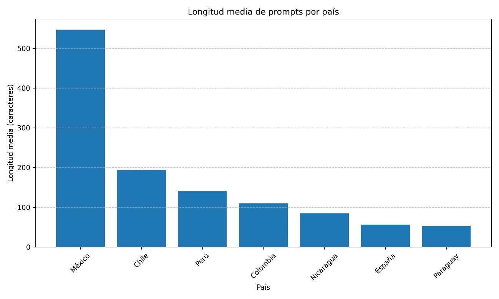

Así, si nos vamos al detalle de cada país podemos ver que:

**México** es con diferencia el país con la longitud media más alta de 547 caracteres. Esto refleja prompts muy detallados, probablemente con instrucciones complejas o dominio especializado (como vimos en el análisis del argot del narcotráfico). Además, sugiere una intención de evaluación profunda o técnica, más que simplemente idiomática.

**Chile** tiene la segunda longitud media más alta, con 194 caracteres. Aquí los prompts tienden a incluir contexto situacional o instrucciones amplias, lo que puede enriquecer la evaluación, pero también requiere más procesamiento por parte del modelo. Posiblemente refleja un enfoque comunicativo más pragmático y contextualizado.

**Colombia y Nicaragua** tienen prompts de longitud media de 110 y 85 caracteres, respectivamente. No son ni tan cortos ni tan extensos dentro del contexto del dataset. Esto podría reflejar una estrategia de prompts instruccionales simples, pero no minimalistas, posiblemente con un enfoque más directo o conversacional.

**España**, en tanto, tiene una longitud media de 56 caracteres, la más baja por lejos. Con prompts can breves como “la mona” o “un, dos, tres”. Probablemente dentro de este grupo se incorporan muchos ejemplos de activación cultural breve o expresiones idiomáticas que no requieren un contexto extenso. Esta economía exige atención, pues, si bien puede ser una estrategia útil para testear inferencias, también puede generar ambigüedad o variabilidad en la evaluación de preferencias.

Países con prompts más largos (como México y Chile) probablemente favorecen tareas de mayor complejidad semántica y contextual, útiles para entrenar modelos más robustos. Mientras que países con prompts breves (como España) pueden ser eficaces para evaluar conocimiento y fluidez, pero requieren una curación cuidadosa para evitar respuestas demasiado abiertas o inconsistentes.

El siguiente diagrama de caja representa la similitud semántica (medida como similitud coseno, entre 0 y 1) entre las respuestas elegidas (“chosen”) y rechazadas (“rejected”) para cada país:

Esta figura permite visualizar la distribución de datos numéricos de manera compacta. De esta forma la caja representa el 50% central de los datos (rango intercuartílico), es decir, donde se concentran la mayoría de las similitudes. La línea horizontal dentro de la caja indica la mediana (valor medio de la distribución). Las líneas que se extienden desde los bordes de la caja hasta el valor más lejano que no es considerado atípico se llaman “bigotes”. Los puntos individuales fuera de los bigotes son los outliers: respuestas que fueron mucho más similares o diferentes de lo esperado.

En este caso, Colombia y Nicaragua presentan la mayor similitud: la mediana en ambos está cerca de 0,6, y el 50% central de las similitudes se mantiene en un rango elevado. Esto indica que las respuestas “chosen” y “rejected” generadas a partir de los prompts de estos países son semánticamente parecidas**,** lo que sugiere diferencias más sutiles en estilo o enfoque que en contenido. Esto puede implicar una mayor dificultad para evaluar por preferencia**,** ya que ambas respuestas son razonablemente válidas.

España muestra una amplia variabilidad, aunque su mediana es alta (~0,57), se observan numerosos outliers con similitudes muy bajas y muy altas**.** Esto refleja el uso frecuente de prompts breves o ambiguos, que pueden dar lugar tanto a interpretaciones muy distintas como a respuestas casi idénticas. La dispersión sugiere inestabilidad en la diversidad de respuestas**,** lo que puede ser un reto para la evaluación humana y para el entrenamiento fino por preferencias.

Chile y Perú muestran patrones intermedios. Las medianas rondan el 0,5, con distribuciones relativamente simétricas. En Chile, esto parece vinculado al uso de prompts de longitud media a larga, que generan respuestas variadas pero comparables. En Perú, la presencia de outliers hacia valores bajos indica que algunos pares de respuestas fueron muy distintos entre sí, quizás por prompts abiertos o de carácter cultural específico.

México presenta las respuestas más diferentes entre sí; la mediana es muy baja (~0,18), y los valores están concentrados en un rango estrecho. Esto coincide con el hecho de que los prompts mexicanos en el dataset son más extensos y específicos (longitud media: 547 caracteres), lo que genera respuestas con estructuras y contenidos más distintos entre modelos. Es el país donde, con más probabilidad, los evaluadores encontraron diferencias claras entre opciones.

Paraguay se sitúa en la media, pero con alta dispersión. Aunque el número de prompts es menor, se observa una distribución amplia, lo que sugiere que la naturaleza de los prompts varía significativamente en complejidad o especificidad.

Esta gráfica confirma que la longitud, especificidad y contexto cultural de los prompts influyen directamente en la similitud de las respuestas generadas**,** y por tanto en la calidad del proceso de alineación por preferencias. Prompts largos y contextuales (como los de México) favorecen la diferenciación entre respuestas, mientras que prompts breves o vagos (como algunos en España) pueden conducir a ambigüedad o redundancia en la generación, lo que complica el entrenamiento y la evaluación.

## e) Temas frecuentes por país

Otra parte fundamental del análisis general del dataset consistió en clasificar los prompts según sus temáticas predominantes, para eso hice uso de una clasificación semi supervisada, utilizando un pipeline de clasificación de texto por cero disparos (zero-shot classification) utilizando el modelo facebook/bart-large-mnli a través de la biblioteca transformers.

La ventaja de este modelo es que permite asignar etiquetas temáticas, sin requerir un entrenamiento previo sobre un etiquetado manual. Definí siete categorías principales, seleccionadas por su relevancia sociolingüística y cultural. Éstas son: cultura, sociedad, lengua, historia, estereotipos, opinión y políticas públicas.

Cada entrada dentro del dataset se clasificó por separado en tres partes: prompt; correspondiente a la instrucción dada al modelo, respuesta elegida (chosen); la preferida por los evaluadores humanos y respuesta descartada (rejected); la respuesta descartada por los evaluadores.

El modelo facebook/bart-large-mnli fue seleccionado por su capacidad comprobada para realizar tareas de clasificación en varios idiomas mediante inferencia textual. Aunque no está entrenado específicamente en español, su rendimiento en tareas multilingües lo hace apto para este tipo de análisis temático a gran escala, especialmente cuando se usan etiquetas generales y bien diferenciadas.

El proceso se aplicó a más de 600 entradas y los resultados se almacenaron en un archivo CSV. A partir de éste, generé el gráfico de barrasy el mapa de calor (heatmap) que muestro a continuación:

Este gráfico de barras muestra la frecuencia total de temas en el dataset. Aquí se aprecia un fuerte enfoque en los aspectos sociales y culturales. **Estereotipos** destacan como la categoría dominante. Esto sugiere que muchas instrucciones buscan evaluar si los modelos detectan y reproducen prejuicios y sesgos culturales. **Cultura, lengua y sociedad** juntas representan gran parte del conjunto del dataset, muy en línea con el objetivo del hackathon de explorar la variación lingüística, cortesía, referencias locales y usos sociales de las distintas variantes del castellano. Historia y opinión están presentes en una menor proporción, aportando prompts centrados en contextualización local y evaluación de creencias.

### f) Distribución temática por país

El mapa de calor permite observar la diversidad temática en relación con las variedades regionales del español, en él se refleja detalladamente el número de prompts por país y categoría:

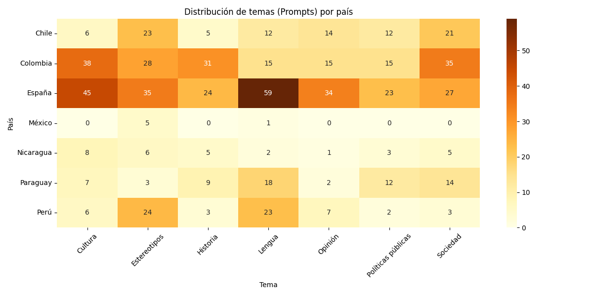

**España** tiene una amplia cobertura temática, pensemos también que es el país que cuenta con la mayor cantidad de datos, aun así, hay un énfasis en lengua, cultura y opinión. El marcado liderazgo en la temática de lengua podría sugerir un interés por evaluar la norma y la variación dialectal.

**Colombia** se distribuye con cierta homogeneidad entre cultura, sociedad, historia y estereotipos. Esto muestra una transversalidad entre los contenidos culturales y sociales.

**Chile** y **Perú** muestran una clara tendencia hacia la categoría de los estereotipos. Tal vez esto refleje una estrategia centrada en la detección de sesgos culturales y pruebas de adecuación cultural, es decir, medir la sensibilidad pragmática y sociolingüística del modelo.

**México** no tiene presencia en casi ninguna categoría, salvo unos casos mínimos en estereotipos y en lengua. Esto se corresponde con el número total de prompts de México en todo el dataset.

**Paraguay** y **Nicaragua** aportan variedad, especialmente en *historia* y *políticas públicas*, aunque en volúmenes más reducidos.

## 3.1.1 Conclusiones del análisis general 

El análisis general del dataset revela una alta variabilidad en la longitud, complejidad y estilo de los prompts según el país, lo que influye directamente en la a diversidad y similitud de las respuestas generadas por los modelos.

Principales hallazgos:

1.  **Distribución desigual por país**: la mayor cantidad de prompts proviene de España, seguida de Colombia y Chile, mientras que países como México o Paraguay están menos representados. Este desequilibrio tiene implicaciones para el fine-tuning, ya que puede inducir sesgos hacia ciertas variedades del español si no se compensa adecuadamente.

2.  **Diferencias en complejidad y extensión:** en promedio, los prompts mexicanos son los más largos y detallados, lo que da lugar a respuestas más diferenciadas entre modelos. Por el contrario, los prompts de España tienden a ser breves y culturalmente cargados (como referencias a fábulas o expresiones populares), lo que genera respuestas más similares o altamente variables, según el grado de inferencia requerido.

3.  **Distribución de complejidad textual:** México y Chile presentan una mayor proporción de prompts de de complejidad media o alta, mientras que en España predominan los prompts breves. Esta variedad puede ser una ventaja para evaluar distintos aspectos del comportamiento del modelo, pero también plantea desafíos para la consistencia del conjunto del entrenamiento, si no se etiqueta o filtra adecuadamente.

4.  **Similitud entre respuestas “chosen” y “rejected”:** la similitud coseno entre respuestas revela patrones significativos; en México, por ejemplo, las respuestas tienden a ser claramente distintas, lo que facilita la evaluación por preferencias. En cambio, en Colombia y Nicaragua, las respuestas son más similares entre sí, lo que puede reflejar tareas menos abiertas. En España, la alta dispersión sugiere inestabilidad generativa ante prompts breves y/o ambiguos.

5.  **El dataset comprende una gama de países y diversidad de temáticas:** la clasificación temática permite constatar que el dataset no sólo cubre países, sino que también aborda una diversidad significativa de contenidos socioculturales. Esta riqueza temática es clave para evaluar cómo los modelos responden ante contextos discursivos variados**,** y para entrenarlos en alineación por preferencias culturales**,** asegurando sensibilidad al contenido, al tono y a las expectativas comunicativas locales.

6.  **Potencial del dataset para la alineación por preferencias:** el conjunto del dataset ofrece una buena base para entrenar modelos alineados con preferencias culturales, especialmente si se complementa con metadatos y análisis lingüísticos adicionales. Sin embargo, es importante considerar el equilibrio entre países, el control de calidad de los prompts breves y la anotación de factores pragmáticos o discursivos que podrían estar influyendo en la elección de las respuestas.

## 3.2 Análisis lingüístico 

El dataset construido presenta un potencial significativo para alinear modelos de lenguaje con preferencias culturales específicas. Sin embargo, para aprovechar plenamente esta capacidad, es necesario ir más allá del análisis cuantitativo general e incorporar un enfoque lingüístico más profundo.

En particular, el estudio de los estilos discursivos, los usos pragmáticos, la formalidad, y la adecuación cultural de las respuestas generadas permite comprender qué respuesta fue preferida, y por qué. Esta dimensión es crucial para entrenar modelos más sensibles a la variación contextual, al registro y a las normas comunicativas propias de cada país hispanohablante.

Los análisis lingüísticos adicionales que se presentan a continuación incluyen:

- El estudio de longitudes, registros y estructuras discursivas en respuestas ‘chosen’ y ‘rejected’.

- Observación del uso de conectores y cómo estos colaboran en la cohesión discursiva.

- Proximidad interpersonal entendida por el uso de las primera, segunda y tercera persona gramatical.

- La comparación de niveles de formalidad y tono conversacional en las respuestas preferidas.

- Y, cuando es posible, la contraposición estilística entre modelos, observando diferencias en la construcción de respuestas frente a un mismo prompt.

Estos elementos permitirán caracterizar mejor los datos y establecer criterios más sólidos para futuras iteraciones del dataset o ajustes finos del modelo.

### a) Longitud media de respuestas y su vínculo con el estilo

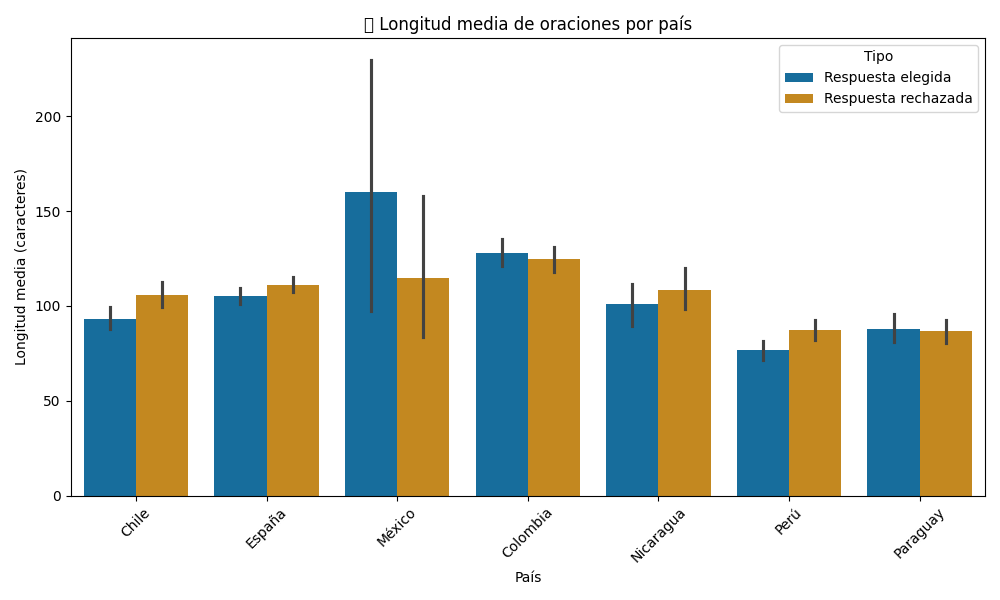

Este gráfico de barras muestra las diferencias entre la longitud media de las respuestas elegidas y las rechazadas por país. Aunque por sí sola la longitud no es determinante al hablar de la calidad de las respuestas, sí puede ofrecer pistas sobre el estilo comunicativo preferido en el alineamiento humano.

Principales observaciones:

**México** presenta la mayor diferencia entre respuestas elegidas y rechazadas, con una media de más de 160 caracteres para las respuestas elegidas, lo que sugiere una preferencia por desarrollos más extensos. Sin embargo, la varianza es elevada, lo que indica una mayor heterogeneidad estilística.

**Chile**, **España** y **Nicaragua**, muestran diferencias más estables entre ambas categorías, y, a diferencia de México, las respuestas rechazadas tienden a ser ligeramente más largas que las elegidas.

En **Colombia** las respuestas elegidas son levemente más largas lo que, nuevamente, podría reflejar una preferencia por desarrollos más completos o bien estructurados.

**Paraguay** y **Perú** presentan longitudes similares en ambas categorías lo que sugiere que la elección de respuestas no depende exclusivamente de la extensión, sino de otros factores como registro, claridad, o adecuación cultural.

Una hipótesis lingüística para la relación entre la longitud y la aceptación de las respuestas es que ésta podría estar mediada por aspectos como:

- el registro discursivo: dado que las respuestas más extensas podrían incluir conectores, atenuadores o estructuras formales que contribuyen a la percepción de calidad y naturalidad.

- Desarrollo argumentativo: en contextos donde se valora la argumentación o ejemplificación, probablemente se prefieran respuestas más largas.

- Valor en la concisión: en algunos países como Paraguay, respuestas breves, pero directas, pueden haber sido preferidas si su contenido era claro y pragmático.

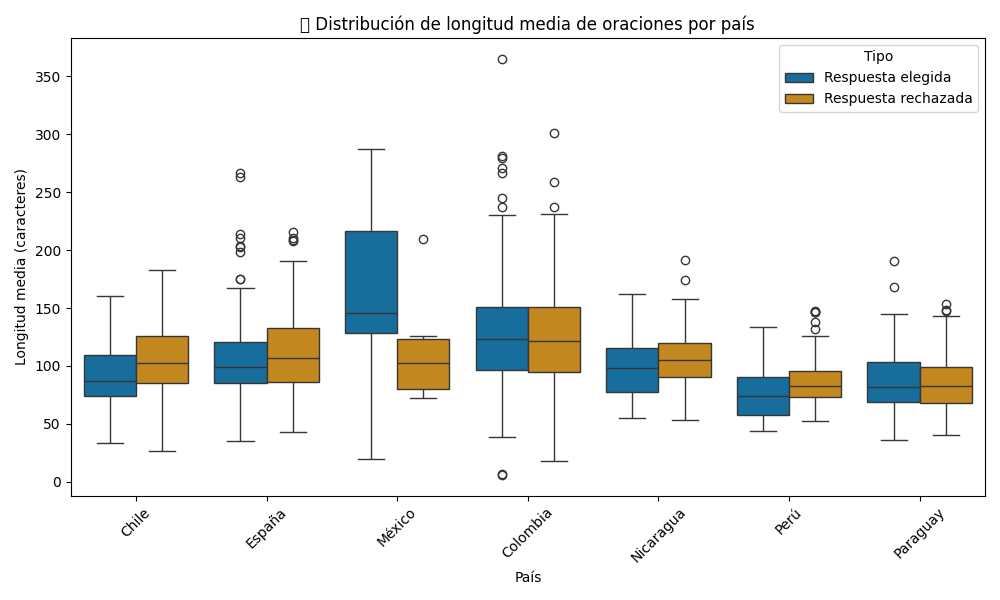

El gráfico de violín o boxplot sirve para complementar las observaciones anteriores.

Principales observaciones:

**México y Colombia** tienen la mayor dispersión, especialmente en las respuestas elegidas. Esto podría reflejar una menor homogeneidad en el estilo de escritura del modelo o en los criterios de evaluación humana.

**Chile, España** y **Nicaragua** presentan distribuciones más compactas, lo que sugiere una mayor consistencia en la longitud de las respuestas. Sin embargo, se observa un ligero desplazamiento hacia arriba en las respuestas rechazadas en estos países, lo que podría indicar que respuestas más extensas no necesariamente fueron preferidas.

**Paraguay** y **Perú** muestran longitudes más bajas y con menor dispersión general, lo que coincide con la hipótesis de que respuestas más breves y concisas pueden haber sido favorecidas.

En general, las medianas de las respuestas elegidas y de las rechazadas son similares, aunque en países como México y Nicaragua las respuestas elegidas tienen a ser un poco más extensas, lo que sugiere una preferencia por explicaciones más detalladas.

Ahora, para observar la diferencia en la cohesión textual y el registro discursivo entre modelos aislé el uso de conectores discursivos por país y tipo de respuesta.

Los conectores discursivos son palabras o frases que ayudan a enlazar ideas dentro de un texto y que sirven para darle coherencia y fluidez. En español los principales conectores son adverbios, preposiciones, conjunciones, interjecciones o locuciones formadas con este tipo de palabras (sin embargo, además, por lo tanto, etc.).

En el siguiente gráfico se muestran los países que participaron en la generación de prompts, junto a las respuestas elegidas (chosen) y rechazadas (rejected) diferenciadas por color. Las barras indican el promedio de conectores para ese tipo de respuesta y país.

### b) Los conectores y la cohesión discursiva

Aislar el uso de los conectores revela información acerca del nivel de cohesión discursiva, ya que los conectores son un marcador lingüístico importante que aporta naturalidad y fluidez a los textos, además un mayor número puede indicar una respuesta más estructurada. Por otra parte, si las respuestas elegidas tienen sistemáticamente más conectores que las respuestas rechazadas, podrían reflejar una preferencia del anotador (o del criterio de selección) por respuestas más desarrolladas discursivamente. Por último, comparar los promedios entre países permite observar diferencias estilísticas y culturales. Por ejemplo, un país podría preferir respuestas más directas, mientras que otro inclinarse por las más explicativas. Tal vez se podría inferir que si un país tiene valores muy bajos en ambos tipos de respuestas se deba a que prefiere respuestas breves y/o de estilo directo.

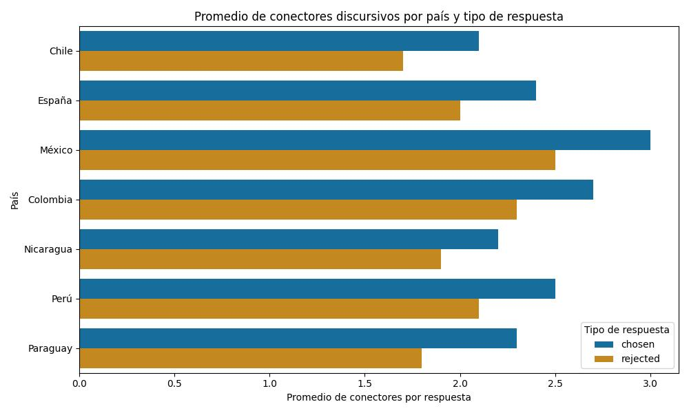

### c) Registro comunicativo y proximidad interpersonal

La selección de usos de la primera, segunda y tercera persona al comunicarnos puede revelar aspectos del registro, tono comunicativo, proximidad interpersonal y estilo argumentativo. Por ello, es importante observar aquí cuáles son los usos que los evaluadores de los modelos han preferido en los diferentes contextos culturales.

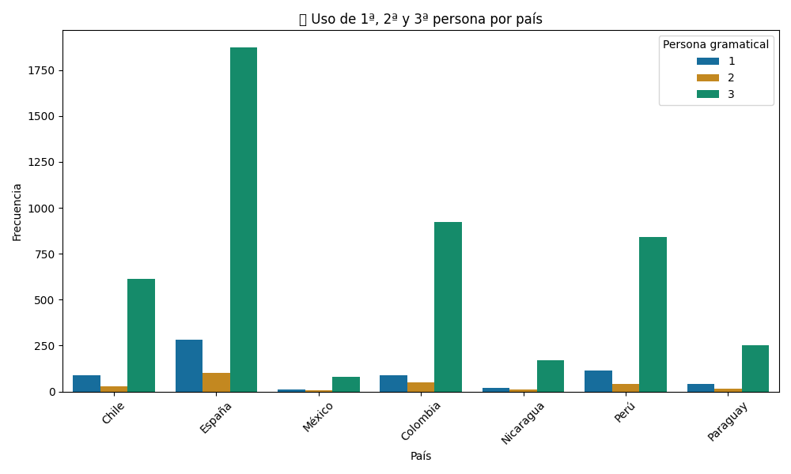

El gráfico de barras muestra que la tercera persona es por lejos la más utilizada en todos los países, lo que sugiere una preferencia por estructuras informativas o expositivas. Se prefiere sobre todo la impersonalidad.

En países como España, Colombia y tal vez Perú, hay una presencia importante del uso de la primera persona, lo que podría indicar un tono más experiencial en las respuestas. En todos los países, el uso de la segunda persona es menos frecuente. Esto indica que pocas respuestas adoptan un tono apelativo o conversacional hacia un interlocutor.

Este análisis sirve para entender cómo los modelos tienden a estructurar las respuestas en función de los distintos estilos discursivos, posiblemente influenciados por el país de origen del prompt y de cómo podría alinearse o no con las preferencias culturales o los estilos comunicativos locales.

El mapa de calor que aparece a continuación muestra en detalle la frecuencia de uso de la persona gramatical por país:

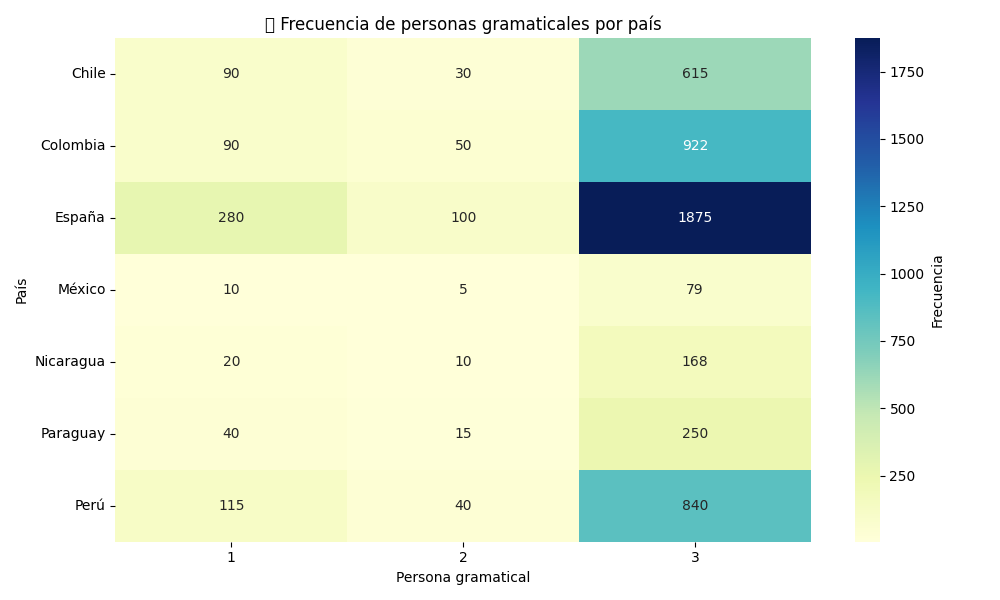

### 

### d) Tiempos verbales en las variantes del español 

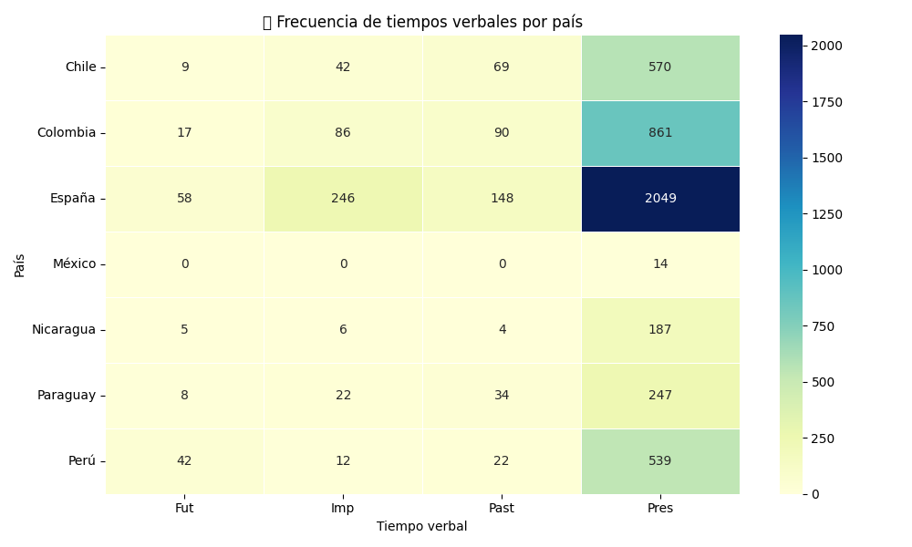

El gráfico de calor representa la frecuencia de aparición de cuatro tiempos verbales (futuro, pretérito imperfecto, pasado -pretérito perfecto simple o compuesto- y presente) en las respuestas generadas por los modelos (*chosen* y *rejected*) según país. La intensidad del color indica el volumen de ocurrencias.

Principales observaciones:

En todos los países hay un uso mayoritario del tiempo presente. Especialmente en España. Esto refleja un estilo más bien impersonal o atemporal, tal vez alineado con prácticas discursivas neutras.

España también destaca en el uso del pretérito imperfecto y el pasado, esto puede estar vinculado a prompts de narrativas históricas, relatos o contrastes entre situaciones pasadas y presentes. Colombia y Chile muestran un uso moderado de esos tiempos verbales.

En todos los países hay escasa presencia del uso del futuro, aunque España, Colombia y Perú, pero sigue siendo el tiempo verbal minoritario. Tal vez se deba a que los modelos se centran más en análisis y descripción que en predicción.

Aunque México, Nicaragua, Paraguay y Perú, en un menor volumen total de datos, igualmente presentan un patrón con una clara preferencia por el presente.

Interpretación lingüística:

Desde la perspectiva pragmática el presente tiende a asociarse con un tono que transmite objetividad, o que es atemporal, muy frecuente para tareas que exigen respuestas generales o definiciones.

El pretérito imperfecto y el pasado aportan un valor narrativo, útil en ejemplos, comparaciones o evocaciones de contexto.

El futuro, al estar más ausente, podría estar asociado a respuestas con bajo nivel de aceptación o a escasos prompts formulados en este tiempo verbal.

En cuanto a la distribución de tiempos verbales según la persona gramatical, los datos son claros; hay un dominio del uso de la tercera persona y del presente, con más de 10.500 ocurrencias, propio del estilo impersonal, informativo y declarativo (en casos como “se dice que…”, “la gente suele pensar que…”) También el uso de la primera persona del presente es relevante, con más de 2.000 ocurrencias. Esto indica una cantidad significativa de respuestas que adopta un enfoque subjetivo o referencial (con expresiones como “en mi opinión” o “creo que”).

La segunda persona está muy poco presente en todos los tiempos verbales, esto sugiere que los modelos evitan adoptar una voz dirigida al interlocutor, tal vez para mantener la neutralidad y evitar un tono demasiado directo. Con respecto al uso pretérito imperfecto y el pasado estos se concentran en la tercera persona gramatical, lo que refuerza la hipótesis de que estas formas verbales están asociadas a relatos, referencias históricas o explicaciones culturales (como “en el pasado se creía que…” o “la dictadura afectaba a todos los sectores”).

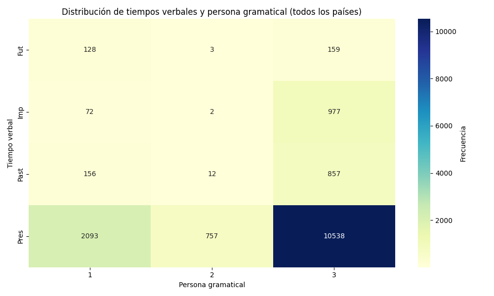

### **e) Registro de tono por país**

Una vez que se ha hecho el desglose de los usos de las personas gramaticales es posible ver los registros formales e informales en el caso de la segunda persona gramatical formal (usted) e informal (tú).

El gráfico de barras apiladas representa la frecuencia con la que se emplean los registros formales e informales en las respuestas generadas por los modelos, desglosadas por país. Aquí se puede ver que hay un predominio del registro formal en casi todos los países, lo que sugiere que los modelos tienden a adoptar un tono más cortés o respetuoso en su interacción con el usuario, alineado con normas de asistencia general.

Colombia destaca por tener la mayor cantidad de formas formales, esta preferencia está alineada con el uso extendido del “usted” en muchas regiones del país. En contraste, España tiene una clara preferencia por las formas informales, aunque también presenta algunos casos de usos formales. Chile y Perú presentan una distribución mixta, aunque con predominancia informal. México, Nicaragua y Paraguay muestran una baja frecuencia total de registros, pero todos se inclinan hacia lo informal.

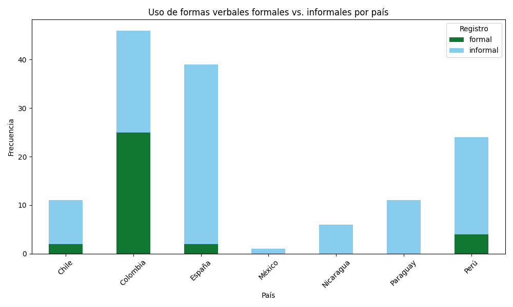

Este análisis es relevante para el alineamiento lingüístico, pues permite observar cómo los modelos pueden reproducir o acentuar ciertos patrones sociolingüísticos por país. Así, un modelo bien alineado debería ser capaz de ajustar su registro gramatical según el país, el dominio del discurso y el tipo de interacción. El predominio del registro informal podría ser una señal de desequilibrio en los datos de entrenamiento o una falta de sensibilidad a normas pragmáticas más conservadoras o de rangos etarios heterogéneos. Casos como el de Colombia podrían interpretarse como un indicio de mayor adecuación cultural.

### 

### f) Estilos discursivos

¿El español utilizado en cada país tiende a ser más formal, narrativo o descriptivo? ¿Hay algún estilo discursivo que prime por sobre otro en todos los países? La siguiente gráfica permite comparar cómo se distribuyen estilos discursivos en las respuestas elegidas y rechazadas a nivel global, independiente del país de origen del prompt. Los cinco estilos discursivos definidos en este análisis son: narrativo, formal, informal, descriptivo y opinativo.

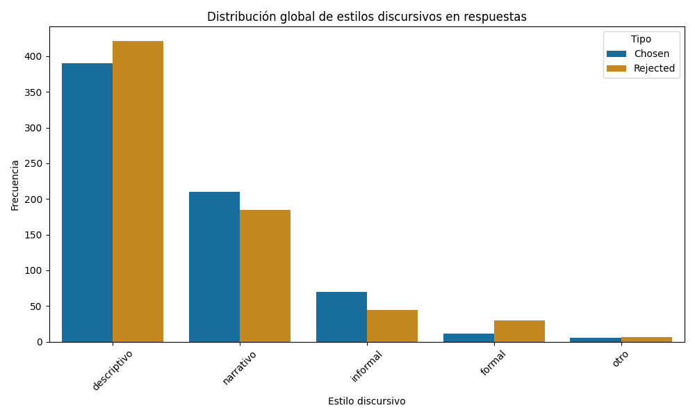

Aquí se puede ver que el estilo preferido por los evaluadores es **el descriptivo**, preferido con mayor frecuencia en las respuestas elegidas, aunque también es el estilo predominante en las respuestas rechazadas. Esto sugiere que, aunque es el estilo predominante, esto no es garantía de que hayan escogido esas respuestas meramente por sus cualidades descriptivas, como desarrollar una idea con claridad y estructura. De hecho, el protagonismo del estilo descriptivo tanto en las respuestas escogidas, como en las rechazadas sugiere que la preferencia debe depender de otros factores.

El **estilo narrativo** es el segundo más común en ambos tipos de respuestas. En este caso, además, es mayor número de respuestas de estilo narrativo elegidas que las rechazadas, por lo que tal vez este estilo esté más alineado con las expectativas del evaluador.

El **estilo informal** es notoriamente apreciado al momento de la evaluación, por ello hay más respuestas elegidas que rechazadas en esta categoría. Lo que sugiere que los evaluadores califican positivamente los textos de tono coloquial o que muestran un mayor grado de cercanía, esto probablemente porque mejora la naturalidad de la respuesta, sobre todo en los prompts que exigen cercanía o tono conversacional.

La presencia de respuestas de **estilo formal** es bastante menor al resto de los otros estilos y esta categoría destaca por tener proporcionalmente el mayor número de respuestas rechazadas. Esto, tal vez, tiene que ver con una adecuación estilística, donde un tono demasiado técnico o formal choca con las preferencias deseadas, donde quizá se espera una respuesta más cercana.

Dentro de la categoría “otro” se agrupan todas aquellas respuestas aquellas respuestas que no se ajustan claramente a ninguna de las categorías principales.

Reflexión lingüística:

Este análisis sugiere que **el estilo discursivo es un factor lingüístico relevante** en la evaluación de las respuestas, pero su impacto depende del contexto y de las expectativas pragmáticas del prompt. El uso del estilo informal y narrativo aparece como una señal positiva en términos de preferencia, mientras que el estilo excesivamente formal podría resultar contraproducente.

### g) Análisis de los estilos discursivos por país

Observar la elección de estilos discursivos según el país de origen del prompt permite inferir diferencias culturales o de estrategia del dataset.

España y Chile destacan por la **variedad estilística**: Chile tiene un uso equilibrado de los estilos descriptivo, informal y narrativo. España muestra un uso alto del estilo descriptivo, pero también presenta muchas respuestas de estilo narrativo.

El **estilo narrativo** tiene una presencia importante en casi todos los países, lo que podría indicar una valoración hacia respuestas subjetivas o experienciales.

Colombia, al igual que España, también muestra preferencia por el **estilo descriptivo**. Esto es coherente con una tendencia hacia respuestas más informativas y estructuradas.

En países como Chile, Colombia y Perú el **estilo informal** aparece con frecuencia moderada, lo que podría estar relacionado con el uso de expresiones coloquiales o registros conversacionales aceptados como válidos por el modelo y los evaluadores.

El **registro formal** es el menos frecuente e incluso nulo en países como México, Nicaragua y Paraguay.

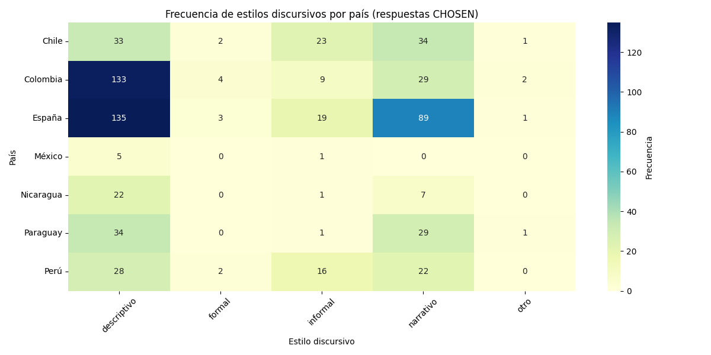

En el caso de las respuestas rechazadas la tendencia le mantiene, aunque llama la atención el aumento de respuestas de estilo formal en España y Perú, esto podría indicar que respuestas demasiado formales o técnicas no necesariamente son valoradas como mejores. En contraste, el estilo informal está menos presente en las respuestas rechazadas que en las escogidas, lo que puede ser un indicador de que en muchos casos la informalidad fue valorado al momento de la selección de la respuesta.

Como ya se ha hecho mención en otras partes del análisis, países como México y Nicaragua presentan muy poca frecuencia en todos los estilos, esto se debe a la poca participación de estos países dentro del dataset o con respuestas más neutras difíciles de categorizar estilísticamente.

Reflexión final:

Los patrones que muestran las gráficas sugieren que el estilo discursivo podría influir en la preferencia del modelo o del evaluador, aunque esta esta influencia no es homogénea en todos los países. La preferencia de los estilos descriptivo y narrativo se contrapone al rechazo de los estilos formal o poco desarrollados. Además, aparentemente el uso de un estilo informal favorece la elección de la respuesta, especialmente cuando no se contrapone con la claridad del contenido.

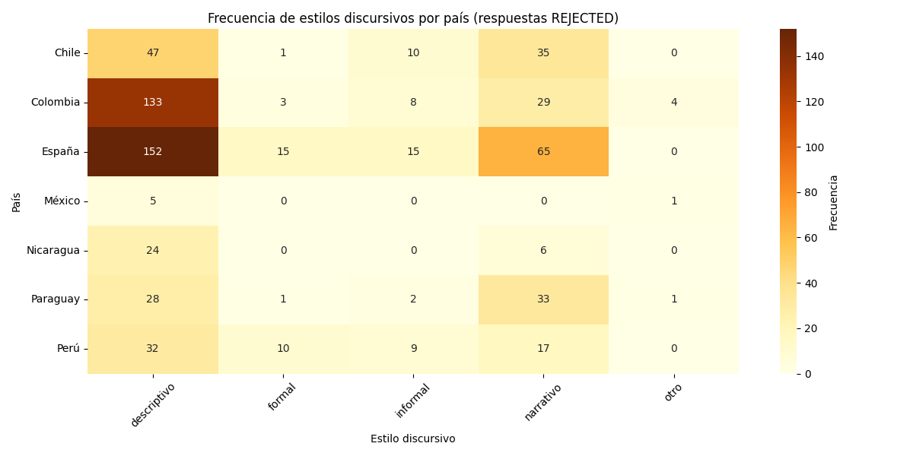

Para cerrar el análisis del estilo de las respuestas y el comportamiento al momento de la elección veamos el siguiente gráfico que muestra la frecuencia de cambio de estilo entre la respuesta elegida y la respuesta rechazada:

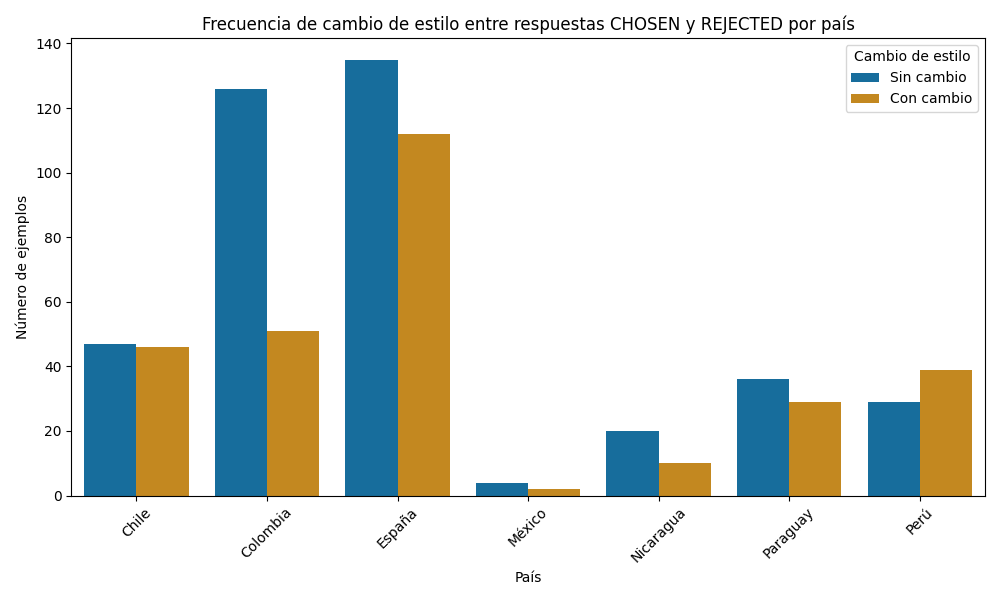

Aquí se puede observar que, como ya sabemos, España y Colombia son los países con mayor pares de respuestas. Además de eso, aquí podemos ver que en ambos países predomina no cambiar el estilo al momento de elegir una respuesta. Aunque, sobre todo en España, los casos con cambio de estilo existen y corresponden a una proporción importante del total de sus respuestas, lo cual sugiere que en ciertos casos el cambio de estilo podría favorecer la selección de la respuesta.

Chile muestra una proporción muy equilibrada entre la selección de la respuesta con cambio de estilo y las sin cambio, esto podría significar que en el caso de Chile el estilo discursivo es un rasgo significativo al momento de optar por una respuesta u otra.

Perú es el único país que presenta más casos de respuesta seleccionadas con cambio de estilo. Una señal de lo especialmente decisivo que fue para el evaluador de ese país el estilo discursivo.

## 3.2.1 Conclusiones del análisis lingüístico

El análisis lingüístico del dataset revela que la preferencia por unas respuestas frente a otras no depende únicamente de un factor, sino de cómo el contenido de la respuesta se articula en una serie de factores. La comparación sistemática entre respuestas elegidas y rechazadas muestra que factores estilísticos, pragmáticos y culturales juegan un papel determinante en la alineación por preferencias.

Principales hallazgos:

1.  **Longitud y estilo comunicativo:** la extensión de las respuestas no es un criterio absoluto de calidad, pero marca tendencias importantes. En pasíses como México y Colombia las respuestas elegidas tienen a ser más extensas, sugiriendo una valoración del desarrollo argumentativo; en cambio, en Paraguay o Perú la concisión aparece como un criterio más valorado. Esto demuestra que la cualidad de “buena respuesta” varía culturalmente, por lo que debe calibrarse por país.

2.  **Conectores y cohesión discursiva:** el mayor uso de conectores en respuestas elegidas indica que los evaluadores valoran la fluidez y coherencia textual, lo que refuerza la idea de que los modelos deben ser entrenados tanto en contenido, como en habilidades discursivas, para mejorar la naturalidad y legibilidad.

3.  **Registro comunicativo y proximidad interpersonal:** el predominio de la tercera persona apunta a una preferencia por un estilo más impersonal e informativo. No obstante, la presencia de la primera persona en España, Colombia y Perú refleja que en ciertos contextos culturales un tono experiencial puede ser más valorado. El uso de la segunda persona se mantiene marginal, lo que indica que los modelos tienden a evitar un estilo demasiado apelativo o directo.

4.  **Tiempos verbales y estilo narrativo:** el tiempo presente domina en todos los países, reforzando un tono general de objetividad y atemporalidad. Sin embargo, el uso más frecuente del pretérito imperfecto y pasado en España y Colombia revela la importancia de los recursos narrativos y contextuales, en especial en prompts ligados a historia, tradición o cultura. Esto demuestra que los modelos deben ser capaces de ajustar sus tiempos verbales según el género discursivo que el prompt demande**.**

5.  **Registro formal e informal:** Los datos muestran una preferencia general por el registro formal, especialmente en Colombia y Perú, aunque España se inclina hacia lo informal y Chile combina ambos. Esta variación confirma que la sensibilidad sociolingüística es indispensable para la adecuación cultural del modelo, pues el mismo mensaje expresado con *usted* o *tú* puede tener implicaciones distintas según el país.

6.  **Estilos discursivos:** El estilo descriptivo es el más frecuente, pero no siempre determinante en la elección, ya que aparece también en muchas respuestas rechazadas. En cambio, los estilos narrativo e informal muestran un peso positivo en las respuestas elegidas, sugiriendo que los evaluadores valoran la naturalidad, cercanía y capacidad explicativa. El estilo formal, por el contrario, se asocia con mayor frecuencia a respuestas rechazadas, lo que indica que un tono excesivamente técnico o distante suele ser contraproducente.

7.  **Cambio de estilo y preferencias culturales:** El análisis comparativo muestra que, mientras en España y Colombia la mayoría de las respuestas elegidas mantienen el mismo estilo que las rechazadas, en Chile y sobre todo en Perú el cambio de estilo fue un factor decisivo para la selección. Esto apunta a que en ciertos contextos culturales el estilo discursivo es más determinante que en otros.

# Limitaciones y dificultades

## 4.1 Limitaciones

Este trabajo, aunque ofrece una primera aproximación sistemática al análisis de preferencias culturales en Large Language Models (LLMs) hispanohablantes, presenta algunas limitaciones que conviene señalar:

1.  **Desbalance geográfico del dataset:** la representación de países fue desigual, con predominio claro de España y Colombia, y escasa presencia de México y Nicaragua. Este desbalance puede inducir sesgos en los resultados y limita la generalización de las conclusiones.

2.  **Heterogeneidad en la longitud y complejidad de los prompts:** mientras algunos países aportaron instrucciones breves y culturalmente cargadas (como por ejemplo España), otros generaron prompts largos y especializados (ej. México). Esta diferencia de diseño afecta la comparabilidad y puede condicionar la forma en que los modelos generan y diferencian sus respuestas.

3.  **Clasificación temática y estilística automática**: aunque en un principio la clasificación se hizo manual, por eficiencia se optó por la clasificación automática en base a modelos de zero-shot classification (facebook/bart-large-mnli), que permitió etiquetar los datos de manera rápida. Este enfoque, aunque es útil para agilizar el análisis, presenta limitaciones, pues tiende a cometer errores en casos ambiguos. Aquí no siempre reconoce expresiones idiomáticas propias del español y puede sobre predecir categorías mayoritarias, invisibilizando estilos minoritarios. Asimismo, no capta matices pragmáticos como ironía, cortesía o atenuación. Por ello, los resultados deben considerarse **aproximaciones generales** y no una categorización lingüística exhaustiva.

4.  **Imposibilidad de integrar modismos y pragmática cultural**: aunque se intentó diseñar un clasificador de modismos mediante IA generativa (con instrucciones y ejemplos), las pruebas con distintos modelos fallaron en identificar de manera consistente expresiones locales o coloquiales en el dataset. Esto impidió observar en qué medida los modelos generan o comprenden modismos y si estos eran preferidos o rechazados en la curación.

5.  **Ausencia de análisis sintáctico profundo**: por limitaciones de tiempo no fue posible incluir métricas estructurales avanzadas, como el estudio de oraciones subordinadas, la frecuencia de oraciones interrogativas/exclamativas o la profundidad de los árboles sintácticos. Estas dimensiones habrían aportado un nivel adicional de detalle en la caracterización de los estilos discursivos.

6.  **Cobertura limitada de registro sociolingüísticos**: aunque se analizó la formalidad, la persona gramatical y los estilos discursivos, no se incluyeron variables pragmáticas más finas como ironía, atenuación o marcadores regionales específicos, lo cual sería clave en futuras ampliaciones del corpus.

7.  **Dependencia del contexto del hackathon**: el dataset fue construido en un marco temporal limitado y con criterios prácticos. Una recolección más extensa y equilibrada permitiría mayor robustez en los resultados.

## 4.2 Dificultades

En el desarrollo de este trabajo se enfrentaron diversas dificultades técnicas y metodológicas:

1.  **Procesamiento computacional intensivo:** algunas tareas, como la clasificación de estilos y la extracción de rasgos lingüísticos con spaCy, requirieron un alto costo en tiempo de ejecución, especialmente en Google Colab con recursos limitados.

2.  **Manejo de prompts extremadamente breves:** casos como el prompt “la mona” evidencian la dificultad de evaluar instrucciones mínimas, cuya interpretación depende fuertemente del contexto cultural. Esto complicó la comparación entre países y la consistencia del análisis.

3.  **Intentos fallidos de detección de modismos**: e diseñó un experimento con IA generativa para crear un clasificador de expresiones idiomáticas locales, incluyendo instrucciones y ejemplos, con el fin de detectar modismos en el dataset. Sin embargo, las pruebas con distintos modelos no lograron identificar consistentemente la presencia de expresiones coloquiales, por lo que esta dimensión tuvo que ser omitida del análisis final.

4.  **Limitaciones de tiempo en el análisis sintáctico**: debido al marco temporal del trabajo de fin de prácticas no fue posible realizar un análisis más profundo de la estructura gramatical de las respuestas. Se dejaron fuera métricas como el uso de subordinadas, la frecuencia de oraciones exclamativas o interrogativas, y la complejidad de los árboles sintácticos, que habrían aportado un nivel adicional en la caracterización de estilos discursivos.

5.  **Ambigüedad en las respuestas rechazadas**: en varios países, las diferencias entre respuestas *elegidas* *y rechazadas* no fueron evidentes en contenido, sino en estilo o registro, lo que dificultó identificar patrones claros sin un análisis lingüístico más fino.

# Conclusiones

El análisis realizado sobre el dataset de prompts y respuestas en castellano ha permitido demostrar el potencial de este recurso para la alineación de modelos de lenguaje con preferencias culturales y comunicativas propias de los países hispanohablantes.

En primer lugar, el estudio cuantitativo evidenció patrones de distribución y diferencias significativas entre países, tanto en la longitud de los prompts y respuestas como en la similitud entre pares de respuestas elegidas y rechazadas. Estos hallazgos muestran que, aunque existen regularidades globales, la preferencia por un tipo de respuesta está condicionada por factores culturales y pragmáticos.

En segundo lugar, el análisis lingüístico permitió profundizar en dimensiones discursivas y estilísticas que trascienden la mera extensión de los textos. Factores como el uso de conectores, la preferencia por determinadas personas gramaticales, la predominancia del tiempo presente, y la elección de registros formales o informales mostraron variaciones relevantes según el país. Asimismo, se observó que los estilos descriptivo, narrativo e informal tienden a ser mejor valorados, mientras que el estilo excesivamente formal se asocia con mayor frecuencia a respuestas rechazadas. Estos resultados refuerzan la importancia de la adecuación cultural y estilística en la alineación de modelos.

En tercer lugar, la comparación entre respuestas elegidas y rechazadas reveló que la selección preferida no depende de un sólo rasgo (como la longitud o la forma verbal), sino de una combinación de factores discursivos, pragmáticos y contextuales, que en conjunto determinan la percepción de naturalidad, claridad y pertinencia. Este hallazgo confirma la necesidad de diseñar datasets y evaluaciones que integren una mirada lingüística integral, más allá del conteo de palabras o la similitud semántica.

Finalmente, el trabajo pone en evidencia tanto las posibilidades como las limitaciones de este tipo de análisis. Entre las **principales limitaciones destacan el** **desbalance geográfico del corpus** **y la imposibilidad de integrar en esta versión fenómenos como el uso de modismos o estructuras sintácticas más complejas.** No obstante, estas limitaciones abren líneas de investigación futura, orientadas a enriquecer el dataset con dimensiones pragmáticas y culturales más finas.

En suma, el presente análisis demuestra que el dataset constituye una base sólida para el entrenamiento y la evaluación de modelos más sensibles a la diversidad cultural del castellano, y que **la integración de análisis lingüísticos profundos resulta indispensable para avanzar hacia LLMs mejor alineados con los usos, estilos y normas comunicativas de cada comunidad hispanohablante.**
